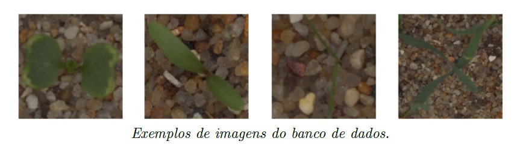

# Primeiro Trabalho: Classificação de mudas de plantas

## Objetivo
Determinar a espécie de uma muda a partir de uma imagem

## Especificações

### O que pode usar
- Arquiteturas baseadas em redes neurais convolucionais (ResNet, VGG, AlexNet, ...)
- Pode-se utilizar qualquer arquitetura do estado da arte

### O que não pode usar
- Redes pré-treinadas

## Dataset
O dataset de mudas de planas contém imagens de aproximadamente 960 plantas únicas pertencentes a 12 espécies em vários estágios de crescimento. Ele compreende imagens RGB anotadas com uma resolução física de aproximadamente 10 pixels por mm. O banco de dados foi registrado na estação de pesquisa Flakkebjerg da Universidade de Aarhus em uma colaboração entre a Universidade do Sul da Dinamarca e a Universidade de Aarhus.

### Onde baixar o dataset e mais detalhes
[Plant Seedlings Dataset](https://vision.eng.au.dk/plant-seedlings-dataset/) (usar o V1 da competição do Kaggle)

### Exemplos de imagens do banco de dados

## Informações do Trabalho

### Tamanho dos grupos
Até 3 alunos

### Como o trabalho deve ser entregue
Em um notebook jupyter completamente comentado e identificado com os passos da solução do problema e o porquê a estratégia/arquitetura/otimização dos parâmetros foram escolhidos. Citar as referências necessárias sempre que for o caso.

### Prazos e Entrega
- **Data de entrega**: até 16 de dezembro
- **Link para entrega**: https://forms.gle/53XKNkRX7Nb74riZ6

**Data da apresentação**: 19 de dezembro durante a aula